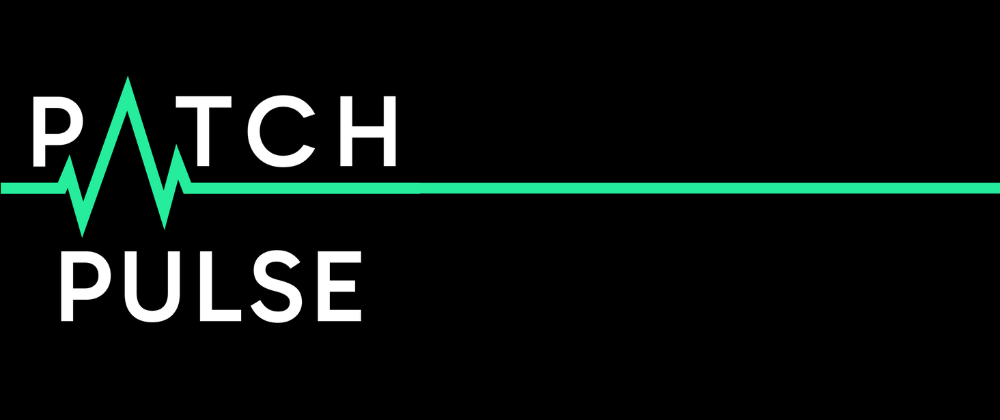

# Patch Pulse CLI

Patch Pulse CLI is a tool that identifies out-of-date dependencies in your `package.json` file, ensuring your project stays up-to-date with the latest versions available on npm.

 [](https://npmjs.com/package/patch-pulse) [](https://npmjs.com/package/patch-pulse) [](https://codecov.io/gh/PatchPulse/cli) [](https://github.com/PatchPulse/cli/actions/workflows/ci.yml)
 



## Table of Contents

- [Installation](#installation)
- [Quick Start](#quick-start)
- [Usage](#usage)
- [Example](#example)
- [Patch Pulse Ecosystem](#patch-pulse-ecosystem)
- [Troubleshooting](#troubleshooting)
- [Contributing](#contributing)
- [Support](#support)
- [License](#license)
- [Author](#author)

## Installation

No installation required! Just ensure you have [Node.js](https://nodejs.org) installed to use npx.

## Quick Start

Navigate to your project's root directory and run:

```bash
npx patch-pulse
```

That's it! Patch Pulse will scan your `package.json` and show you which dependencies are out of date.

## Usage

### Basic Usage

```bash
# Check all dependencies in current directory
npx patch-pulse

# Show help information
npx patch-pulse --help

# Show version information
npx patch-pulse --version
```

### What Gets Checked

Patch Pulse automatically checks all dependency types in your `package.json`:

- **dependencies** - Production dependencies
- **devDependencies** - Development dependencies
- **peerDependencies** - Peer dependencies
- **optionalDependencies** - Optional dependencies

## Example

This is a screenshot from the v1 output. We plan on updating this soon.


## Patch Pulse Ecosystem

Patch Pulse is more than just a CLI tool! Explore our growing ecosystem:

- **🔧 CLI Tool** (this repo) - Check dependencies from your terminal
- **⚡ VSCode Extension** ([@PatchPulse/vscode-extension](https://github.com/PatchPulse/vscode-extension)) - Get dependency updates directly in your editor _(Work in progress)_
- **🤖 Slack Bot** ([Add Slack Bot to Workspace](https://slack.com/oauth/v2/authorize?client_id=180374136631.6017466448468&scope=chat:write,commands,incoming-webhook)) - Get notified of package updates in Slack

_More tools coming soon!_

## Troubleshooting

### Common Issues

**"No dependencies found to check"**

- Make sure you're running the command from a directory containing a `package.json` file
- Verify your `package.json` has dependencies defined

**"Error reading package.json"**

- Ensure your `package.json` is valid JSON
- Check file permissions

**Network errors**

- Verify your internet connection
- Check if npm registry is accessible

## Contributing

We welcome contributions! Here's how you can help:

1. **Fork and clone** the repository
2. **Install dependencies** with `npm install`
3. **Make your changes** following the existing code style
4. **Submit a pull request** with a clear description

**Guidelines:**

- Add tests for new features
- Update documentation as needed
- Keep commits atomic and well-described

## Support

### Community & Help

- ⭐ **Star the repository** on GitHub
- 🐛 **Report bugs** and request features via [GitHub Issues](https://github.com/PatchPulse/cli/issues)
- 💬 **Join discussions** in [GitHub Discussions](https://github.com/PatchPulse/cli/discussions)
- 📢 **Share** with your team and community

## License

This project is licensed under MIT - see the [LICENSE](LICENSE) file for details.

## Author

This Patch Pulse CLI tool is maintained by [@BarryMichaelDoyle](https://github.com/barrymichaeldoyle).

**🎥 Live Development:** Sometimes I stream my development process on [Twitch](https://twitch.tv/barrymichaeldoyle) - feel free to drop by and say hello!

---

**Made with ❤️ for the Node.js community**
